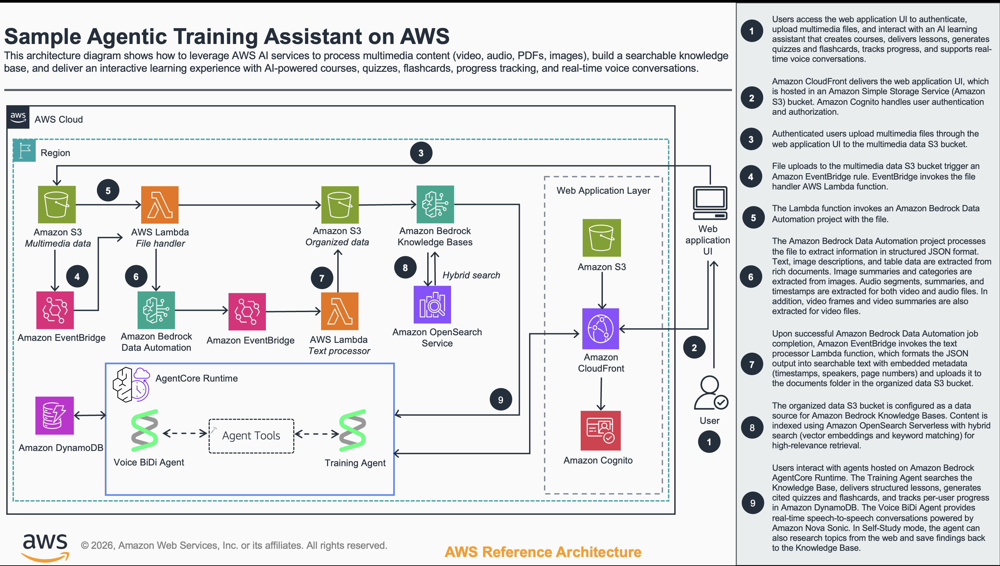

# Multimodal AI Learning Assistant on AWS

An AI-powered learning platform that transforms multimedia content — videos, audio, PDFs, and images — into a personalized, interactive learning experience. Upload your content, and the assistant builds a searchable knowledge base, creates structured courses, delivers adaptive lessons, quizzes you with intelligent feedback, and tracks your progress over time.

https://github.com/user-attachments/assets/667178b2-24a7-4ae6-8f39-532189c84ff6

## What You Can Do

**Turn any content into a knowledge base.** Upload videos, podcasts, PDFs, or images and the platform automatically extracts, indexes, and organizes the content. Ask questions in natural language and get answers with citations that link directly to the source — click a video timestamp to jump to the exact moment, or a page reference to open the right spot in a PDF.

**Create courses from any topic.** Describe what you want to learn and the assistant researches it, structures it into a multi-part course with subtopics, and populates each section with real content. Courses are saved to your library and can be revisited anytime.

**Learn through structured lessons.** Each subtopic is delivered as a structured lesson: a motivating hook, a clear explanation of the core concept, a concrete example drawn from your knowledge base, and a concise takeaway. The assistant adapts based on your history — if you've struggled with a topic before, it adjusts its approach.

**Test yourself with interactive quizzes.** After each lesson, take quizzes generated from the actual content. Get immediate, cited feedback that explains *why* the correct answer is right. Answer incorrectly and the assistant re-explains using a different angle before trying again.

**Review with flashcards.** Reinforce key concepts with auto-generated flashcards. Mark cards as mastered or flag them for review — your progress persists across sessions.

**Track your learning.** Every quiz score, flashcard review, and checklist completion is recorded. The assistant identifies weak areas and suggests what to study next, creating a personalized learning path.

**Talk to your assistant.** Switch to voice mode for real-time speech-to-speech conversations powered by Amazon Nova Sonic. Ask questions, get explanations, and learn hands-free.

**Choose your learning mode.** Training Mode keeps you focused on your uploaded knowledge base with structured study. Self-Study Mode unlocks web research and the ability to save new findings directly to your knowledge base.

## Architecture Overview



The application consists of three independent codebases deployed as a modular AWS CDK application:

### Application Layer

- **`agent/`** — Python backend powered by [Strands Agents](https://github.com/strands-agents/strands-agents) and FastAPI. An orchestrator agent with 20 tools (9 core + 11 self-study) handles knowledge base search, course creation, lesson delivery, quiz generation, progress tracking, and web research. Serves the [AG-UI protocol](https://docs.ag-ui.com) for real-time frontend communication. Voice mode uses BidiAgent with Amazon Nova Sonic for speech-to-speech.
- **`frontend/`** — Next.js 16 + React 19 + TypeScript with [CopilotKit](https://www.copilotkit.ai/) for the chat interface. Interactive UI components (QuizCard, FlashcardDeck, MediaViewer, DataPanel) for quizzes, flashcards, checklists, media viewing, file upload/processing, and progress dashboards. Deploys as a static site to S3/CloudFront.
- **`cdk/`** — AWS CDK (TypeScript) infrastructure-as-code. One-command deployment of the full stack.

### Infrastructure Stacks (CDK)

1. **Storage & Distribution Stack** (`storage-dist-stack.ts`)
   - Media Bucket: Secure bucket for uploaded source files
   - Organized Bucket: Processed and extracted content
   - Application Host Bucket: Frontend static site
   - CloudFront distribution with Origin Access Control

2. **Auth Stack** (`auth-stack.ts`)
   - Cognito User Pool for authentication
   - Cognito Identity Pool for authorized access to AWS resources
   - User Pool Client for application integration

3. **OpenSearch Stack** (`opensearch-stack.ts`)
   - OpenSearch Serverless collection for vector search
   - Custom resource creates kNN indices

4. **Processing Stack** (`processing-stack.ts`)
   - Initial Processing Lambda: Handles S3 uploads and triggers Bedrock Data Automation
   - BDA Processing Lambda: Processes extraction results into searchable text with metadata (timestamps, speakers, page numbers)
   - Bedrock Knowledge Base with vector store integration
   - DynamoDB table for courses, user progress, and preferences
   - File Status DynamoDB table for tracking upload and processing state per file

5. **AgentCore Stack** (`agentcore-stack.ts`, optional — deployed when `deployAgentCore=true`)
   - AgentCore Memory for conversation persistence (STM + LTM)
   - Configurable memory expiry and LTM strategies
   - Integrated with Cognito for user-specific memory namespaces

### AWS Services Used

| Service | Purpose |
|---------|---------|
| Amazon Bedrock | Foundation models (Claude) for the AI assistant |
| Amazon Nova Sonic | Real-time speech-to-speech voice conversations |
| Bedrock Knowledge Bases | Vector search over uploaded and researched content (retrieves 15 results, reranks to top 5 via Cohere Rerank) |
| Bedrock Data Automation | Extracts text from videos, audio, PDFs, and images |
| Bedrock AgentCore Runtime | Managed agent hosting with memory integration |
| Amazon OpenSearch Serverless | Vector store for knowledge base embeddings |
| Amazon DynamoDB | Courses, user progress, preferences, and learning state |
| Amazon S3 + CloudFront | Frontend hosting and media storage |
| Amazon Cognito | User authentication and authorization |

### Data Flow

```
Upload (video/audio/PDF/image)
  -> S3 Media Bucket
  -> EventBridge triggers Processing Lambda
  -> Bedrock Data Automation extracts text + metadata
  -> Organized Bucket stores processed content
  -> Bedrock Knowledge Base indexes for vector search
  -> Agent queries KB and delivers cited responses
```

## Key Parameters

| Parameter | Description | Default/Constraints |
|-----------|-------------|-------------------|
| ModelId | The Amazon Bedrock supported LLM inference profile ID used for inference. | Default: "us.anthropic.claude-sonnet-4-6" |
| EmbeddingModelId | The Amazon Bedrock supported embedding LLM ID used in Bedrock Knowledge Base. | Default: "amazon.titan-embed-text-v2:0" |
| DataParser | The data processing strategy to use for multimedia content. | Default: "Bedrock Data Automation" |
| ResourceSuffix | Suffix to append to resource names (e.g., dev, test, prod) | Alphanumeric + hyphens, 1-20 chars |

## Features
- AI-powered course creation with automatic web research per subtopic
- Structured lesson delivery: Hook, Concept, Example, Takeaway
- Interactive quizzes with cited feedback and adaptive remediation
- Flashcard review with mastery tracking
- Per-user progress tracking with concept-level insights
- Learning checklists per course subtopic
- Two learning modes: Training (KB-focused) and Self-Study (web research enabled)
- Multimedia content processing (video, audio, PDF, image)
- Cited responses with clickable video timestamps and PDF page links
- Real-time speech-to-speech conversations via Amazon Nova Sonic
- Conversation persistence with AgentCore Memory (STM + LTM)
- Web research with Tavily search and save-to-KB
- User authentication with Amazon Cognito

## Security Features
- IAM roles with least privilege access
- Cognito User Pool for authentication
- JWT-based authorization — user identity derived server-side from token
- Tool filtering enforced server-side based on user mode stored in DynamoDB
- CloudFront with Origin Access Control for secure content delivery

## Prerequisites
- AWS CLI with credentials configured
- Node.js 18+ and npm
- Python 3.12+ and [uv](https://docs.astral.sh/uv/)
- AWS CDK CLI (`npm install -g aws-cdk`)
- Git
- Docker (for AgentCore Runtime container builds)
- Bedrock model access enabled for: Claude (inference), Titan Embed Text v2 (embeddings), Cohere Rerank v3.5 (KB reranking), and optionally Nova Sonic (voice)

# Deployment

## Option 1: Automated Deployment (Recommended)

The solution includes a comprehensive deployment script that handles all aspects of deployment:

1. Clone the repository and navigate to the project folder:
   ```bash
   git clone <repository-url>
   cd sample-multimodal-training-assistant
   ```

2. Run the deployment script:
   ```bash
   ./deploy.sh -e dev
   ```

This will deploy:
- All infrastructure stacks with default options
- Frontend application
- Local development configuration

## AgentCore Runtime Deployment

### Quick Start

```bash
# First time: Deploy everything
./deploy.sh -e dev -r us-west-2

# Update agent code only
./deploy.sh --agentcore-runtime -e dev -r us-west-2
```

### How It Works

1. **Full Deployment** (`./deploy.sh`)
   - Deploys CDK infrastructure (Memory, execution role, etc.)
   - Deploys AgentCore Runtime with the agent
   - Stores Runtime ARN in SSM

2. **Agent Updates** (`./deploy.sh --agentcore-runtime`)
   - Copies latest agent code + dependencies
   - Rebuilds Docker image
   - Updates both text and voice AgentCore Runtimes
   - Same Runtime ARNs (no frontend changes needed)

### What Gets Deployed to AgentCore

**Agent code:**
- `agents/` — Orchestrator agent with system prompt and tool routing
- `tools/` — KB search, course management, lesson delivery, quiz generation, progress tracking, web research
- `lib/` — KB client (with Cohere reranking), DynamoDB client, user context utilities
**Infrastructure references (from SSM/CloudFormation):**
- Region, KB ID, model ID, DynamoDB table, S3 buckets
- Rerank model ID (default: `cohere.rerank-v3-5:0`)
- Tavily API key (if configured via `--tavily-key`)
- Memory ID, execution role from CDK stack
- Deployment mode: Container (Docker)

**Two runtimes are deployed:**
- **Text Runtime**: AG-UI protocol for chat (Claude model)
- **Voice Runtime**: BidiAgent with Amazon Nova Sonic for speech-to-speech

### Memory Integration

The deployed agent automatically:
- Reads memory ID from SSM
- Extracts `actor_id` from Cognito JWT
- Configures user-specific memory namespaces
- Persists conversations across sessions

### Deployment Options

| Option | Description | Default |
|--------|-------------|---------|
| -e ENV | Environment name for resource naming | dev |
| -r REGION | AWS region | from AWS CLI config |
| -p PROFILE | AWS profile name to use | default |
| -m DAYS | Memory expiry duration in days | 30 |
| -s | Skip infrastructure deployment (generate config only) | false |
| -i | Generate local configuration only (no deployment) | false |
| --agentcore-runtime | Update AgentCore Runtime agent code only | false |
| --frontend | Build and deploy static Next.js frontend to S3/CloudFront | false |
| --tavily-key KEY | Store Tavily API key in SSM (enables web research in Self-Study mode) | - |
| --memory disable | Disable AgentCore Memory | enabled by default |
| --ltm disable | Disable Long-Term Memory (use STM only) | LTM enabled by default |
| -h | Show help message | - |

### Example Deployment Commands

#### Full Deployment
```bash
./deploy.sh -e dev -r us-west-2
```
Deploys all infrastructure stacks plus AgentCore Memory, generates local config files.

#### Update Agent Code Only
```bash
./deploy.sh --agentcore-runtime -e dev -r us-west-2
```
Rebuilds and deploys just the agent to AgentCore Runtime — no infrastructure changes.

#### Deploy Frontend Only
```bash
./deploy.sh --frontend -e dev
```
Builds the Next.js static export and syncs to S3, then invalidates CloudFront cache.

#### Memory Configuration
```bash
# Short-Term Memory only (no long-term learning)
./deploy.sh -e dev --ltm disable

# Custom memory expiry (60 days)
./deploy.sh -e prod -m 60

# Stateless conversations (no memory)
./deploy.sh -e test --memory disable
```

#### Web Research (Self-Study Mode)

Self-Study mode enables web research and course creation from web sources. It requires a [Tavily](https://tavily.com) API key (free tier: 1,000 credits/month).

```bash
# Store the key in SSM (one-time setup)
./deploy.sh -e dev --tavily-key tvly-your-key-here

# Then deploy the agent so it picks up the key
./deploy.sh --agentcore-runtime -e dev -r us-west-2
```

The key is stored as a SecureString in SSM (`/multimedia-rag/{env}/tavily-api-key`). All subsequent `deploy.sh -i` and `--agentcore-runtime` commands read it automatically. Without a Tavily key, the platform works normally in Training mode — only Self-Study web research features are unavailable.

#### Local Config Generation
```bash
./deploy.sh -e dev -i
```
Generates `frontend/.env.local` and `agent/.env` for local development without deploying anything. If a Tavily key is stored in SSM, it's included in `agent/.env` automatically.

## Local Development

```bash
# From the repo root — starts agent (port 8000) + frontend (port 3000)
./start-local.sh
```

If `USE_RUNTIME=true` is set in `frontend/.env.local`, the script skips the local agent and the frontend connects directly to AgentCore Runtime instead.

Or run them separately:

```bash
# Frontend
cd frontend
npm run dev

# Agent (AG-UI protocol on port 8000)
cd agent
uv run main.py
```

**Note:** Local AG-UI mode persists conversation history via S3SessionManager (when `S3_SESSION_BUCKET` is configured) but does not include AgentCore long-term memory. Use AgentCore Runtime for full memory integration (STM + LTM).

## Speech-to-Speech Capabilities

Real-time voice conversations powered by Amazon Nova Sonic via AgentCore BidiAgent:

- **Bidirectional audio streaming**: Talk naturally with your knowledge base using voice
- **Voice-based learning**: Ask questions, get explanations — all by voice
- **WebSocket communication**: Frontend connects via SigV4 pre-signed URL using Cognito Identity Pool credentials
- **Same knowledge base**: Voice agent uses the same KB search and tools as text chat
- **Dedicated voice agent**: Concise system prompt optimized for spoken responses

The voice agent is deployed as a separate AgentCore BidiAgent runtime. The frontend captures mic audio at 16kHz PCM and plays back LPCM 24kHz via an AudioWorklet.

**IMPORTANT**: Amazon Nova Sonic is currently only available in **us-east-1** (N. Virginia).

## AgentCore Memory

Conversation persistence and user preference learning:

### Features
- **Short-Term Memory (STM)**: Maintains conversation history within a session
- **Long-Term Memory (LTM)**: Learns user preferences, facts, and session summaries across sessions
- **User-Specific**: Integrated with Cognito for per-user memory namespaces
- **Configurable Expiry**: Default 30 days, customizable from 3-365 days

### Memory Strategies (LTM)
When LTM is enabled (default), three strategies enhance conversations:
- **Session Summaries**: Automatically summarizes conversation sessions
- **User Preferences**: Learns and stores user preferences across sessions
- **Semantic Facts**: Extracts and stores factual information from conversations

## Usage

### Getting Started
1. Access the application at `https://<CloudFront-Domain-Name>.cloudfront.net/`
2. Sign in with your Cognito credentials
3. Upload content using the DataPanel sidebar — videos, PDFs, audio, or images
4. Wait for processing and KB sync to complete (status tracked per file in the DataPanel)
5. Start chatting — ask questions about your content, request a course, or dive into a lesson

### Learning Workflow
1. **Ask the assistant to create a course** on any topic — it will research and structure it automatically
2. **Select a subtopic** from the course panel to start a lesson
3. **Read the lesson**, then accept the quiz offer to test yourself
4. **Review feedback** — correct answers get confirmation with sources, wrong answers get re-explanation
5. **Track progress** via checklists and the progress dashboard
6. **Use flashcards** to reinforce key concepts

### Learning Modes
- **Training Mode**: Focused on your uploaded knowledge base. Courses, quizzes, flashcards, and progress tracking.
- **Self-Study Mode**: Everything in Training plus web research and save-to-KB. Toggle in the sidebar.

## Supported File Formats

The application supports various file formats through Amazon Bedrock Data Automation:

**Documents:** PDF (.pdf), Microsoft Word (.doc, .docx), Text (.txt), CSV (.csv)

**Images:** JPEG/JPG (.jpg, .jpeg), PNG (.png), TIFF (.tiff), GIF (.gif), BMP (.bmp)

**Video:** MP4 (.mp4), WebM (.webm)

**Audio:** MP3 (.mp3), WAV (.wav), M4A (.m4a)

## Troubleshooting

### Common Deployment Issues

1. **Bedrock Data Automation API Error:**
   - Error: "ValidationException when calling the CreateDataAutomationProject operation"
   - Solution: The BDA API parameters may have changed. Update the audio configuration in `processing-stack.ts`.

2. **Region Compatibility:**
   - Error: Services not available in the selected region
   - Solution: Bedrock Data Automation is available in limited regions. Deploy to a supported region like us-west-2.

3. **CloudFront Issues:**
   - Problem: Frontend not showing after deployment
   - Solution: Check CloudFront distribution status and verify S3 bucket policy allows CloudFront access.

4. **Speech-to-Speech Issues:**
   - Error: Voice agent deployment failed
   - Solution: Verify you are deploying in us-east-1, as Nova Sonic is only available there.

5. **AgentCore Runtime Issues:**
   - Error: Agent code update failed
   - Solution: Ensure Docker is running and your AWS credentials have permissions for AgentCore Runtime operations.

### Missing Environment Variables

If local development is missing configuration:
1. Run `./deploy.sh -e dev -i` to regenerate config files without deployment
2. Verify `.env.local` exists in the `frontend/` directory and `.env` exists in the `agent/` directory

## Cost

You are responsible for the cost of the AWS services used while running this Guidance. As of May 2025, the estimated infrastructure cost for running this Guidance with the default settings is approximately $176 per month (excluding Bedrock model inference and AgentCore Runtime charges).

This estimate is based on a deployment supporting 100 active users executing approximately 1,000 multimedia RAG conversations per month. Each conversation processes an average of 5 multimedia files (PDFs, images, videos, etc.) through the RAG pipeline.

| AWS Service | Dimensions | Cost - USD |
|-------------|------------|------------|
| Amazon S3 | 100GB storage, 5K PUT, 50K GET requests | $4.75 |
| Amazon OpenSearch Serverless | On-demand capacity (8hrs/day), 50GB storage | $152.40 |
| AWS Lambda | 5K retrieval + 5K processing invocations | $1.22 |
| Amazon DynamoDB | On-demand, ~10K reads/writes per month | $1.25 |
| Amazon CloudFront | 100GB data transfer, 1M requests | $9.50 |
| Amazon EventBridge | 5,000 custom events | $0.01 |
| Amazon CloudWatch | 5GB logs, 10 metrics, 1 dashboard | $6.50 |
| Amazon Cognito | 100 monthly active users | $0.28 |
| **TOTAL** | | **~$175.91** |

**Note**: This estimate covers AWS infrastructure costs only. Amazon Bedrock model inference charges, AgentCore Runtime charges, and Amazon Nova Sonic charges apply based on usage and are not included. Refer to [Amazon Bedrock pricing](https://aws.amazon.com/bedrock/pricing/) for current costs.

We recommend creating a Budget through AWS Cost Explorer to help manage costs. Prices are subject to change. For full details, refer to the pricing webpage for each AWS service used in this Guidance.

## Limitations

- **File Size Limits:**
  - Videos: Up to 5GB
  - Audio: Up to 2GB
  - Documents: Up to 20 pages or 100MB
  - Images: Up to 50MB each

- **API Limitations:**
  - Bedrock Data Automation has quota limitations — check AWS documentation for current limits
  - Knowledge Base sync operations can take several minutes to complete

- **Regional Availability:**
  - Bedrock Data Automation is available in limited regions
  - Speech-to-Speech (Amazon Nova Sonic) is only available in us-east-1
  - AgentCore Runtime availability varies by region
  - Ensure all required services are available in your target region

- **Resource Management:**
  - Files must be manually deleted from media and organized buckets
  - Knowledge Base must be manually synced to reflect deleted files

## Cleanup

When you're done with the solution, follow these steps to remove all deployed resources and avoid ongoing charges.

### Automated Cleanup

1. **Empty S3 buckets first** (required before stack deletion):

   ```bash
   # Get bucket names from CloudFormation outputs (replace 'dev' with your environment name)
   MEDIA_BUCKET=$(aws cloudformation describe-stacks \
     --stack-name "MultimediaRagStack-dev" \
     --query "Stacks[0].Outputs[?OutputKey=='MediaBucketName'].OutputValue" \
     --output text \
     --region <your-region> \
     --profile <your-profile>)

   ORGANIZED_BUCKET=$(aws cloudformation describe-stacks \
     --stack-name "MultimediaRagStack-dev" \
     --query "Stacks[0].Outputs[?OutputKey=='OrganizedBucketName'].OutputValue" \
     --output text \
     --region <your-region> \
     --profile <your-profile>)

   APP_BUCKET=$(aws cloudformation describe-stacks \
     --stack-name "MultimediaRagStack-dev" \
     --query "Stacks[0].Outputs[?OutputKey=='ApplicationHostBucketName'].OutputValue" \
     --output text \
     --region <your-region> \
     --profile <your-profile>)

   # Empty all buckets
   aws s3 rm s3://$MEDIA_BUCKET --recursive
   aws s3 rm s3://$ORGANIZED_BUCKET --recursive
   aws s3 rm s3://$APP_BUCKET --recursive
   ```

2. **Delete the CloudFormation stacks**:

   ```bash
   cd cdk

   # Delete AgentCore stack first (if deployed)
   npx cdk destroy AgentCoreStack-dev --profile <your-profile> --region <your-region> --force

   # Delete main stack
   npx cdk destroy MultimediaRagStack-dev --profile <your-profile> --region <your-region> --force
   ```

### Resources Requiring Manual Deletion

Some resources may require manual deletion through the AWS Console:

1. **Amazon Bedrock Knowledge Base** — Navigate to Bedrock console, select the knowledge base (`docs-kb-{environment}`), delete
2. **AgentCore Runtimes** — Delete any AgentCore Runtime deployments via the Bedrock AgentCore console
3. **CloudWatch Log Groups** — Delete log groups containing your environment suffix
4. **OpenSearch Serverless Collection** — If stuck in "DELETING" state, contact AWS Support

### Verification

After cleanup, verify these resources are deleted:
- S3 buckets (Media, Organized, Application Host)
- CloudFront distribution
- Lambda functions
- OpenSearch Serverless collection
- Bedrock Knowledge Base
- Cognito User Pool and Identity Pool
- DynamoDB table
- AgentCore Runtimes and Memory resources
- CloudWatch Log groups

## This sample solution is intended to be used with public, non-sensitive data only
This is a demonstration/sample solution and is not intended for production use. Please note:
- Do not use sensitive, confidential, or critical data
- Do not process personally identifiable information (PII)
- Use only public data for testing and demonstration purposes
- This solution is provided for learning and evaluation purposes only

## Third-Party Services

This solution integrates with the following third-party services in Self-Study Mode. You are responsible for reviewing and complying with their respective terms.

**Tavily Search API** — Used for web research capabilities. Requires a Tavily account and API key. Tavily offers a free tier (1,000 API credits/month) with paid plans for higher usage. Review [Tavily Terms of Service](https://tavily.com/terms) and [Tavily Pricing](https://docs.tavily.com/guides/api-credits) before use.

## Security

See [CONTRIBUTING](CONTRIBUTING.md#security-issue-notifications) for more information.

## License

This library is licensed under the MIT-0 License. See the LICENSE file.

## Notices
Customers are responsible for making their own independent assessment of the information in this Guidance. This Guidance: (a) is for informational purposes only, (b) represents AWS current product offerings and practices, which are subject to change without notice, and (c) does not create any commitments or assurances from AWS and its affiliates, suppliers or licensors. AWS products or services are provided "as is" without warranties, representations, or conditions of any kind, whether express or implied. AWS responsibilities and liabilities to its customers are controlled by AWS agreements, and this Guidance is not part of, nor does it modify, any agreement between AWS and its customers.
